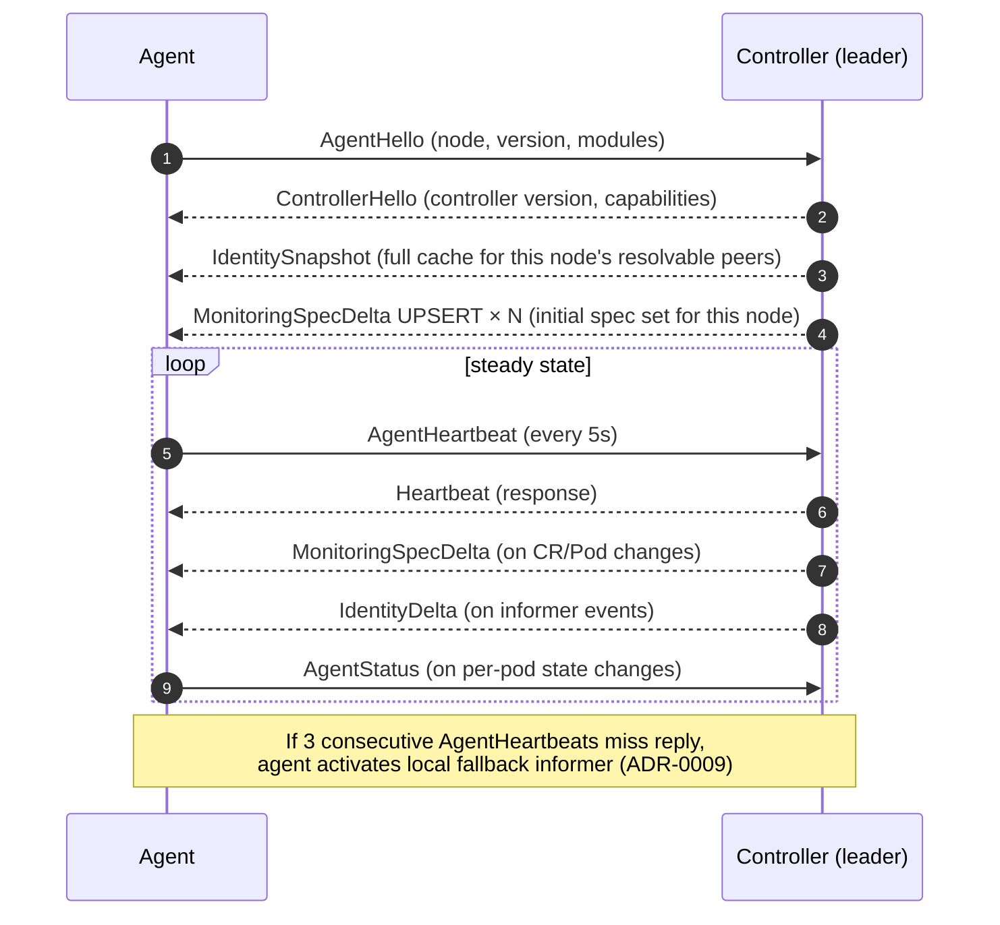

# Control Plane

**Status:** Draft, 2026-05-17
**Owners:** TBD

This document specifies the controller — the CRDs it watches, the algorithm it runs to translate user intent into per-node configuration, and how it distributes that configuration to agents. It implements [ADR-0003](decisions.md#adr-0003-onboarding-model--hybrid-crd) and [ADR-0009](decisions.md#adr-0009-informer-custody--hybrid) and satisfies requirement §2.2.

The control plane owns three responsibilities:
1. **Reconcile user intent** — watch `TrafficMonitor` and `ClusterTrafficPolicy` CRs, plus Pods, and compute per-pod `MonitoringSpec`s.
2. **Distribute to agents** — stream `MonitoringSpec` deltas to the agent on each node.
3. **Broadcast identity** — run the canonical K8s informer for Pods/Services/EndpointSlices and stream identity-cache deltas to agents.

These three concerns share the controller↔agent gRPC stream (§4).

## 1. CRDs

Two CRDs, both at group `obs.gke-labs.dev`:

| CRD | Scope | Purpose |
|---|---|---|
| `TrafficMonitor` | Namespaced | Workload-team-owned, opt-in deeper capture or opt-out |
| `ClusterTrafficPolicy` | Cluster-scoped | Operator-owned default policy |

Both ship at `v1alpha1` initially (per [`public-api.md`](public-api.md) §6).

### 1.1 `TrafficMonitor`

```yaml
apiVersion: obs.gke-labs.dev/v1alpha1
kind: TrafficMonitor
metadata:
  name: payments-monitor
  namespace: payments
spec:
  workloadSelector:
    matchLabels:
      app: payments-api
    # matchExpressions also supported (standard LabelSelector)

  # Which protocol modules to enable for matched pods.
  protocols:
    l4:
      enabled: true
    http:
      enabled: true
      versions: [http1, http2]   # default both
      ports: [8080, 8443]        # if empty, all ports observed by the agent
      captureRoute: true         # extract & template URL path; default true
    grpc:
      enabled: true
      ports: [9090]
    tls:
      enabled: true
      libraries: [openssl, go-crypto-tls]   # which uprobe libs to attach
    a2a:
      enabled: true              # captured-as-HTTP for now; semantic layer when ModuleA2A lands

  # Cardinality knobs (per requirement §2.6).
  cardinality:
    pathTemplating:
      enabled: true
      rules:
        - match: "^/users/[0-9]+$"
          template: "/users/{id}"
        - match: "^/orders/[a-f0-9-]+$"
          template: "/orders/{uuid}"
    sampling:
      headBased:
        rate: 1.0                # spans; 1.0 = keep all
      tailBased:
        rate: 0.1                # used only when headBased rate < 1.0
    aggregation:
      hints:
        - dimension: service     # encourage server-side aggregation along these axes
        - dimension: deployment

  # Override for this selector's pods only; defaults from ClusterTrafficPolicy if unset.
  retention:
    metric: 10m                  # store window for metrics produced by this monitor
    spans: 5m

  # Optional: where to ship data for these pods specifically (in addition to global sinks).
  sinks:
    - name: payments-otlp
      type: otlp
      config:
        endpoint: otlp.payments.svc:4317

status:
  conditions:
    - type: Ready
      status: "True"
      reason: AllPodsCovered
      message: "8/8 selected pods are being monitored"
  observedGeneration: 3
  matchedPodCount: 8
  matchedPodSample:
    - payments-api-7f8c4d-x9k2l
    - payments-api-7f8c4d-3jnvr
  conflicts: []                  # populated if another TrafficMonitor selects overlapping pods
```

### 1.2 `ClusterTrafficPolicy`

```yaml
apiVersion: obs.gke-labs.dev/v1alpha1
kind: ClusterTrafficPolicy
metadata:
  name: default
spec:
  # Same shape as TrafficMonitor.spec, minus workloadSelector.
  # Applied to any pod NOT covered by a TrafficMonitor.
  protocols:
    l4:
      enabled: true              # everyone gets L4 by default
    http:
      enabled: false             # opt-in per workload
    grpc:
      enabled: false
    tls:
      enabled: false
  cardinality:
    pathTemplating:
      enabled: true              # baseline templating
    sampling:
      headBased:
        rate: 1.0
  retention:
    metric: 10m
    spans: 5m

  # Priority is used only if multiple ClusterTrafficPolicy exist (singleton recommended).
  priority: 0

status:
  conditions:
    - type: Ready
      status: "True"
  observedGeneration: 1
  coveredPodCount: 423
```

### 1.3 Conflict resolution

A pod is "covered" by exactly one of:
1. The most-specific `TrafficMonitor` selecting it (most-specific = most label keys; ties broken by name lexicographic), OR
2. The highest-priority `ClusterTrafficPolicy`, if no `TrafficMonitor` selects it.

If two `TrafficMonitor`s in the same namespace select overlapping pods with equal specificity, both are listed in `status.conflicts` on each CR and the controller picks lexicographic-first deterministically. A validating webhook (§5) warns at admission time but does not reject (overlaps may be transient during a rollout).

### 1.4 Generation and storage

- CRD YAML is generated from Go types using kubebuilder markers; regenerate via `ap generate`.
- Stored type defaults to `v1alpha1`; migration to `v1beta1` and `v1` follows K8s conversion-webhook conventions when the schema stabilizes.

## 2. Reconciliation algorithm

The controller runs a single-loop reconciler per CRD plus a Pod watcher. All inputs converge into one in-memory data model: `pod_uid → MonitoringSpec`.

```
Inputs (watched):
  TrafficMonitor      (namespaced)
  ClusterTrafficPolicy (cluster-scoped)
  Pod                 (cluster-wide; for selector match and identity)

Outputs:
  In-memory: podSpecs map[types.UID]MonitoringSpec
  Per-agent: queued MonitoringSpec delta on the gRPC stream
  CR status: matchedPodCount, conflicts, conditions
```

### 2.1 Tick-by-tick

```
on any input event:
  1. Snapshot the relevant slice of the inputs.
  2. Re-resolve coverage for affected pods only (not all pods — input event tells us which).
  3. Compute new MonitoringSpec for each affected pod.
  4. Diff against last-known spec for that pod.
  5. For each changed pod:
     a. Locate its agent (via Pod.Spec.NodeName)
     b. Enqueue a delta on the agent's gRPC stream
  6. Update CR status for any CR whose matchedPods set changed.
```

The reconciler is **not** a full sweep on every event — it's targeted. A `TrafficMonitor` change triggers reconciliation only for pods whose coverage might have changed (matched-now-or-then). This keeps API server load proportional to change rate, not pod count.

### 2.2 `MonitoringSpec`

The on-the-wire and in-memory form of "what to do for this pod":

```go
// in core/pkg/controller — Stability: Stable (the wire form is gRPC, stable too)
type MonitoringSpec struct {
    PodUID       types.UID
    PodName      string
    Namespace    string
    NodeName     string
    PIDHints     []uint32          // optional; agent may resolve PIDs itself

    Protocols    ProtocolSet       // bitset of capture.Module values
    HTTPPorts    []uint16
    GRPCPorts    []uint16
    TLSLibraries []TLSLibrary

    Cardinality  CardinalityConfig
    Retention    Retention
    ExtraSinks   []SinkRef         // names of named sinks to also route to

    Generation   int64             // monotonic; agent ignores deltas with lower Generation
}
```

`SinkRef` references a sink the agent already has registered. Per-CR sink configs are *not* hot-reloaded into agents (would be a security problem — controller could inject sink configs into agents); they are install-time on the agent and the CR can only reference them by name.

## 3. Identity broadcasting

Per [ADR-0009](decisions.md#adr-0009-informer-custody--hybrid), the controller runs the canonical K8s informer for Pods, Services, EndpointSlices. It maintains an in-memory `IdentityCache`:

```go
type IdentityCache interface {
    // IP-keyed lookup (the hot path the agent needs).
    Lookup(ip net.IP) (topology.Identity, bool)

    // Bulk snapshot for new-agent bootstrap.
    Snapshot() []IdentityRecord

    // Watch for deltas.
    Watch(ctx context.Context) <-chan IdentityDelta
}

type IdentityDelta struct {
    Op       Op                     // Add | Update | Remove
    IP       net.IP
    Identity topology.Identity
}
```

The controller broadcasts these deltas to every connected agent on the same gRPC stream that carries `MonitoringSpec`s. Bootstrap is a `Snapshot()` followed by deltas.

Topology document ([`topology.md`](topology.md)) covers the cache's internals; the controller is the canonical owner per ADR-0009.

## 4. Controller ↔ agent gRPC stream

One bidirectional stream per agent. Each agent connects on startup; the controller (leader) accepts.

### 4.1 Service definition

Proto under `core/proto/controlplane/v1/`:

```proto
syntax = "proto3";
package gke.obs.controlplane.v1;

service ControlPlane {
  // Agent → Controller: open the long-lived stream.
  rpc AgentSession (stream AgentMessage) returns (stream ControllerMessage);
}

message AgentMessage {
  oneof body {
    AgentHello        hello = 1;
    AgentHeartbeat    heartbeat = 2;
    AgentStatus       status = 3;
    AgentLocalDigest  digest = 4;   // for resync detection
  }
}

message ControllerMessage {
  oneof body {
    ControllerHello       hello = 1;
    MonitoringSpecDelta   spec_delta = 2;
    IdentitySnapshot      identity_snapshot = 3;
    IdentityDelta         identity_delta = 4;
    SinkRotation          sink_rotation = 5;     // future: hot-rotate ExtraSinks
    Heartbeat             heartbeat = 6;
  }
}

message AgentHello {
  string node_name = 1;
  string agent_version = 2;
  string controller_url = 3;
  repeated string supported_modules = 4;     // capture.Module names
}

message AgentHeartbeat {
  google.protobuf.Timestamp ts = 1;
  uint32 active_monitor_count = 2;
  map<string, uint64> module_event_counts = 3;
  uint32 last_known_generation = 4;
}

message AgentStatus {
  string pod_uid = 1;
  // Reports per-pod monitoring health back so the controller can populate CR status.
  bool active = 2;
  uint32 active_pids = 3;
  string error = 4;
}

message MonitoringSpecDelta {
  enum Op { UPSERT = 0; REMOVE = 1; }
  Op op = 1;
  MonitoringSpec spec = 2;
  int64 generation = 3;
}
```

### 4.2 Stream lifecycle



### 4.3 Reconnection and idempotency

- Agent retries connection with exponential backoff (1s → 30s cap) on disconnect.
- On reconnect, agent sends `AgentLocalDigest` with the highest `generation` it has applied; controller diffs against current state and sends only the necessary deltas.
- All `MonitoringSpec` upserts are idempotent; `MonitoringSpecDelta` carries the spec's `generation` and the agent ignores older.
- Identity cache deltas have monotonic resource versions; agent reconciles snapshots+deltas to a consistent state.

### 4.4 Multiple controllers

Two replicas of the controller run in HA. Only the leader (via `coordination.k8s.io/leases`) accepts agent streams. Non-leaders run informers (warm cache, fast failover) but reject `AgentSession` calls with `FailedPrecondition; not-leader`. Agents handle that error by re-resolving the controller Service DNS and retrying.

## 5. Validating admission webhook

A standard K8s `ValidatingWebhookConfiguration` for `TrafficMonitor` and `ClusterTrafficPolicy` CRs.

### 5.1 Validations

- **Schema:** OpenAPI v3 validation is on the CRD; webhook covers semantic checks.
- **Port overlap:** within a single `TrafficMonitor`, no port appears in two protocols (e.g. 8080 in both HTTP and gRPC).
- **Cardinality sanity:** `sampling.headBased.rate` ∈ [0.0, 1.0]; `pathTemplating.rules[].match` is a compilable RE2 regex.
- **Sink references:** `sinks[].name` must be present in the agent install. Webhook reads a `SinkCatalog` ConfigMap maintained by the operator.
- **Selector reachability:** soft check (warning only) — webhook lists pods matching the selector and warns if zero.
- **Conflict:** soft check — webhook lists other `TrafficMonitor`s in the same namespace with potentially-overlapping selectors and warns.

### 5.2 TLS

Webhook certificates managed by cert-manager (same pattern as the existing POC's query server). `Certificate` resource issued by a self-signed `Issuer` in the install namespace; `caBundle` injected via `cert-manager.io/inject-ca-from` annotation on the `ValidatingWebhookConfiguration`.

### 5.3 Failure policy

`failurePolicy: Fail`. A broken webhook should not allow garbage CRs to land. Webhook readiness is part of `ollie` install gates (Helm / kustomize check the webhook responds 200 before marking install ready).

## 6. Leader election

`k8s.io/client-go/tools/leaderelection` on a `Lease` named `ollie-controller` in the install namespace.

| Parameter | Value | Notes |
|---|---|---|
| Lease duration | 15 s | Tolerates one missed renew |
| Renew deadline | 10 s | |
| Retry period | 2 s | |

The leader runs reconcilers + accepts agent sessions. Followers run informers and admission webhook (any replica can serve admission since it's stateless).

Failover impact: agents see one disconnect, reconnect to the new leader, get a re-sync. Bounded by ~5 s in the typical case.

## 7. RBAC

Manifests sketch (full YAML in `core/k8s/rbac/`):

```yaml
# ServiceAccount per component.
apiVersion: v1
kind: ServiceAccount
metadata: { name: ollie-controller, namespace: ollie-system }
---
# ClusterRole for the controller.
apiVersion: rbac.authorization.k8s.io/v1
kind: ClusterRole
metadata: { name: ollie-controller }
rules:
  # CRDs we own.
  - apiGroups: [obs.gke-labs.dev]
    resources: [trafficmonitors, clustertrafficpolicies]
    verbs: [get, list, watch, update, patch]
  - apiGroups: [obs.gke-labs.dev]
    resources: [trafficmonitors/status, clustertrafficpolicies/status]
    verbs: [update, patch]
  # Identity informer.
  - apiGroups: [""]
    resources: [pods, services, nodes]
    verbs: [get, list, watch]
  - apiGroups: [discovery.k8s.io]
    resources: [endpointslices]
    verbs: [get, list, watch]
  # Leader election.
  - apiGroups: [coordination.k8s.io]
    resources: [leases]
    verbs: [get, list, watch, create, update, patch, delete]
```

Agent and query-server RBAC live in [`operations.md`](operations.md).

## 8. Cardinality controls — where each knob is enforced

Per requirement §2.6, the three cardinality mechanisms cross-cut. The CR is the source of intent; enforcement is distributed:

| Knob | Declared in CR | Enforced by |
|---|---|---|
| Path templating | `cardinality.pathTemplating.rules` | **Data plane** ([`data-plane.md`](data-plane.md)) at enrichment time, before write to store. Regex programs compiled in the agent on `MonitoringSpec` apply. |
| Head sampling | `cardinality.sampling.headBased.rate` | **Data plane** at capture time; eBPF-side where supported (OBI knob), Go-side otherwise. Sampled-out spans never reach the store. |
| Tail sampling | `cardinality.sampling.tailBased.rate` | **Data plane** at write time; spans go to the ring buffer, but the writer evicts at a higher rate per the policy. |
| Aggregation hints | `cardinality.aggregation.hints` | **Storage / query** ([`storage-and-query.md`](storage-and-query.md)) — hints become default PromQL `by(...)` clauses for derived metrics. |

This split lets the most-expensive-to-undo decisions (sampling) happen earliest, and the cheapest (aggregation) happen latest where data is richer.

## 9. CR status and observability

The controller updates CR status as `MonitoringSpec`s land on agents and as agents report `AgentStatus`. Status fields are intentionally rich because operators need to see "is monitoring actually happening":

- `status.matchedPodCount` — total pods matched by the selector
- `status.activelyMonitoredPodCount` — pods that have an active spec on an agent (may lag matchedPodCount briefly during rollouts)
- `status.matchedPodSample` — up to 5 example pod names (for quick eyeballing)
- `status.conflicts` — list of other CR names that overlap
- `status.conditions` — standard K8s conditions: `Ready`, `Degraded`, `Conflicts`
- `status.observedGeneration` — matches `metadata.generation` when reconciler has fully applied

Controller-owned Prometheus metrics (`ollie_controller_*` prefix):

- `…_reconciles_total{kind, result}`
- `…_reconcile_duration_seconds{kind}`
- `…_active_agent_sessions`
- `…_identity_cache_size`
- `…_identity_cache_updates_total{op}`
- `…_spec_deltas_pushed_total{result}`
- `…_leader{}` gauge (1 if this replica is leader)

## 10. Install-time considerations

- Default install includes CRDs, RBAC, controller Deployment (2 replicas), webhook config + Certificate.
- Webhook config uses `cert-manager.io/inject-ca-from` annotation.
- Controller readiness probe checks: leader-election started + at least one informer cache synced.
- Agents reject controller versions below the agent's `minControllerVersion` and vice-versa per [`public-api.md`](public-api.md) §6 skew policy.

## Open questions

1. **Per-CR sink registration vs install-time only.** Today `TrafficMonitor.spec.sinks` references names that must already be installed. Allowing arbitrary sink configs per CR would let workload teams ship to their own targets, but at the cost of trusting CR creators to not poison agents. Likely a future ADR with a vetted sink-template mechanism.
2. **CRD conversion webhook complexity.** When we move `v1alpha1 → v1beta1`, do we ship a conversion webhook or rely on round-tripping via storage? Decision deferred until schema stabilizes.
3. **Agent push of MonitoringSpec request hints.** Today the controller resolves selectors → PIDs centrally. An alternative is the controller broadcasting selectors and agents matching locally. We prefer central resolution (better visibility, fewer agent-side surprises), but the latter scales better with selector complexity. Defer.
4. **CR audit history.** Operators may want to see "who changed this CR and when." K8s audit log covers it, but a `status.history` field could surface recent generations inline. Out of scope for v1.
